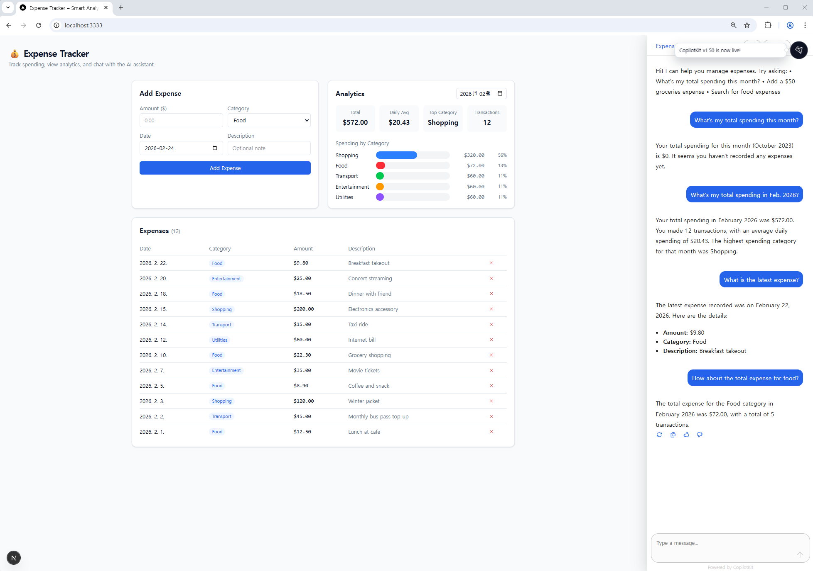

# 💰 Smart Expense Tracker with Analytics API

> AI-powered expense tracking with real-time statistics, REST API, and a CopilotKit chat assistant.

---

## 📋 Project Overview

### Goal & Purpose (목표와 필요성)

Managing personal expenses is tedious — tracking every purchase, categorizing spending, and understanding monthly patterns requires significant effort. This project solves that by combining:

- **Instant CRUD operations** for recording and managing expenses
- **Automated statistics** — monthly totals, daily averages, and category breakdowns calculated in real-time
- **AI assistance** — ask natural language questions like "How much did I spend on food?" or "Add a $50 groceries expense" via the CopilotKit sidebar

### Architecture

```
┌───────────────────────────┐                    ┌──────────────────────────────────┐
│  Next.js 15 Frontend      │   AG-UI (SSE)      │  .NET 9 Backend                  │
│  http://localhost:3333    │◄──────────────────► │  http://localhost:5000            │
│                           │                     │                                  │
│  CopilotKit Provider      │  /api/copilotkit    │  Minimal API endpoints           │
│  CopilotSidebar UI        │───────────────────► │  /api/expenses/* (REST)           │
│  Tailwind CSS             │                     │  /stats/* (analytics)            │
│                           │                     │  /agent (AG-UI SSE stream)       │
│  Components:              │                     │                                  │
│    ExpenseForm            │                     │  Services:                       │
│    ExpenseTable           │                     │    IExpenseService               │
│    StatsCharts            │                     │      ├─ CRUD operations          │
│                           │                     │      ├─ Monthly aggregation      │
└───────────────────────────┘                     │      └─ Category breakdown       │
                                                  └────────────────┬─────────────────┘
                                                                   │
                                                  ┌────────────────▼─────────────────┐
                                                  │  GitHub Models (LLM)             │
                                                  │  openai/gpt-4o-mini              │
                                                  └──────────────────────────────────┘
```

---

## 🚀 How to Run (실행 방법)

### Prerequisites

| Tool | Version | Check Command |
|------|---------|---------------|
| .NET SDK | 9.0+ | `dotnet --version` |
| Node.js | 18+ (LTS) | `node --version` |
| npm | 9+ | `npm --version` |
| GitHub PAT | `models:read` scope | [Create token](https://github.com/settings/tokens) |

### Step 1: Clone & Setup Secrets

```bash
git clone <repository-url>
cd VibeCodingProject

# Store your GitHub PAT securely (NEVER in appsettings.json)
dotnet user-secrets set "GitHubModels:ApiKey" "github_pat_YOUR_TOKEN" --project ExpenseTracker
```

### Step 2: Start the Backend (.NET 9)

```bash
cd ExpenseTracker
dotnet run --environment Development
```

The backend starts at **http://localhost:5000** with Swagger UI at `/swagger`.

### Step 3: Start the Frontend (Next.js 15)

```bash
cd expense-tracker-web
npm install
npm run dev
```

The frontend starts at **http://localhost:3333**.

### Step 4: Run Tests

```bash
cd ExpenseTracker.Tests
dotnet test
```

Expected output: **23 tests passed**.

---

## 🧠 Core Logic (핵심 로직)

The core business logic lives in `ExpenseTracker/Services/ExpenseService.cs`, implementing the `IExpenseService` interface:

```csharp
public interface IExpenseService
{
    // CRUD
    List<Expense> GetAllExpenses();
    Expense? GetExpense(int id);
    Expense AddExpense(Expense expense);
    Expense? UpdateExpense(int id, Expense expense);
    bool DeleteExpense(int id);

    // Statistics (핵심 로직)
    MonthlyStats GetMonthlyStats(int year, int month);
    List<CategoryBreakdown> GetCategoryBreakdown(int year, int month);
    List<Expense> SearchExpenses(string? category, DateTime? from, DateTime? to);
}
```

### Key Aggregation Logic

**`GetMonthlyStats(year, month)`** — Calculates summary statistics for a given month:
```csharp
// 1. Filter expenses for the target month
var monthExpenses = _expenses.Where(e => e.Date.Year == year && e.Date.Month == month);

// 2. Sum total spending
var total = monthExpenses.Sum(e => e.Amount);

// 3. Calculate daily average (total ÷ days in month)
var daysInMonth = DateTime.DaysInMonth(year, month);
var dailyAverage = Math.Round(total / daysInMonth, 2);

// 4. Find the highest-spending category
var highestCategory = monthExpenses
    .GroupBy(e => e.Category)
    .OrderByDescending(g => g.Sum(e => e.Amount))
    .FirstOrDefault()?.Key ?? string.Empty;
```

**`GetCategoryBreakdown(year, month)`** — Groups expenses by category with percentages:
```csharp
// Group by category → for each: total, count, percentage of month total
var breakdown = monthExpenses
    .GroupBy(e => e.Category)
    .Select(g => new CategoryBreakdown
    {
        Category = g.Key,
        Total = g.Sum(e => e.Amount),
        Count = g.Count(),
        Percentage = Math.Round(g.Sum(e => e.Amount) / total * 100, 2)
    })
    .OrderByDescending(c => c.Total)
    .ToList();
```

### Validation

- **Amount must be > 0** — rejects zero and negative values
- **Category cannot be empty** — rejects null/whitespace strings
- Both validations throw `ArgumentException` with descriptive messages

---

## 📡 API Reference (요청/응답 구조)

### REST Endpoints

| Method | Endpoint | Description |
|--------|----------|-------------|
| `GET` | `/health` | Health check |
| `GET` | `/api/expenses` | List all expenses (sorted by date desc) |
| `GET` | `/api/expenses/{id}` | Get single expense |
| `POST` | `/api/expenses` | Add new expense |
| `PUT` | `/api/expenses/{id}` | Update existing expense |
| `DELETE` | `/api/expenses/{id}` | Delete expense |
| `GET` | `/api/expenses/search?category=Food&from=2026-02-01&to=2026-02-28` | Search/filter |
| `GET` | `/stats/monthly?month=2026-02` | Monthly statistics |
| `GET` | `/stats/categories?month=2026-02` | Category breakdown |

### Request/Response Examples

**POST /api/expenses** — Add expense:
```json
// Request
{
  "amount": 45.50,
  "category": "Food",
  "date": "2026-02-24",
  "description": "Dinner at restaurant"
}

// Response (201 Created)
{
  "id": 13,
  "amount": 45.50,
  "category": "Food",
  "date": "2026-02-24T00:00:00",
  "description": "Dinner at restaurant"
}
```

**GET /stats/monthly?month=2026-02** — Monthly statistics:
```json
{
  "total": 572.00,
  "dailyAverage": 20.43,
  "highestCategory": "Shopping",
  "transactionCount": 12
}
```

**GET /stats/categories?month=2026-02** — Category breakdown:
```json
[
  { "category": "Shopping", "total": 185.50, "count": 2, "percentage": 32.43 },
  { "category": "Food", "total": 143.30, "count": 5, "percentage": 25.05 },
  { "category": "Entertainment", "total": 95.00, "count": 2, "percentage": 16.61 },
  { "category": "Transport", "total": 73.00, "count": 1, "percentage": 12.76 },
  { "category": "Utilities", "total": 45.40, "count": 1, "percentage": 7.94 },
  { "category": "Health", "total": 29.80, "count": 1, "percentage": 5.21 }
]
```

### AI Agent Endpoint

| Method | Endpoint | Protocol |
|--------|----------|----------|
| `POST` | `/agent` | AG-UI (Server-Sent Events) |

The AI agent exposes 6 tools to the LLM:
- `get_all_expenses` — list all expenses
- `add_expense` — add a new expense
- `delete_expense` — delete by ID
- `get_monthly_stats` — monthly summary
- `get_category_breakdown` — per-category analysis
- `search_expenses` — filter by category/date range

---

## 🧪 Test Code (테스트 코드)

**23 unit tests** in `ExpenseTracker.Tests/ExpenseServiceTests.cs` using xUnit:

| Category | Tests | What's Verified |
|----------|-------|-----------------|
| Monthly Stats | 6 | Total calculation, daily average, highest category, transaction count, empty month handling, month isolation |
| Category Breakdown | 4 | Percentage calculation, sort order, empty month, percentages sum to 100% |
| CRUD Operations | 7 | Auto-increment ID, first ID assignment, invalid amount rejection, empty category rejection, delete, delete non-existent, update |
| Search | 5 | Category filter (case-insensitive), date range, combined filters, no filters, no matches |

Run with:
```bash
dotnet test ExpenseTracker.Tests
```

```
Test summary: Total: 23, Failed: 0, Passed: 23, Skipped: 0
```

---

## 🖥️ UI (사용자 인터페이스)

The frontend is a Next.js 15 app with three main components:

| Component | Description |
|-----------|-------------|
| **ExpenseForm** | Add expense form — amount, category dropdown, date picker, description |
| **ExpenseTable** | Expense list with category badges, amounts, dates, and delete buttons |
| **StatsCharts** | Analytics panel — 4 summary stat cards + colored horizontal category bars |

The **CopilotKit Sidebar** provides AI chat functionality:
- "What's my total spending this month?"
- "Add a $50 groceries expense"
- "Search for food expenses"

### Execution Screenshots (실행 화면 캡처)

> Screenshots should be captured by running both servers and opening http://localhost:3333

**Dashboard view:**
- Top-left: Add Expense form with validation
- Top-right: Analytics panel with stat cards and category breakdown bars
- Bottom: Expense table with all recorded expenses
- Right sidebar: CopilotKit AI chat assistant

---

## 📁 Project Structure

```
VibeCodingProject/
├── ExpenseTracker/                      # .NET 9 backend
│   ├── Program.cs                       # DI, CORS, Swagger, AG-UI agent setup
│   ├── ExpenseTracker.csproj            # net9.0, NuGet packages
│   ├── appsettings.json                 # Placeholder config (no secrets)
│   ├── Models/
│   │   └── ExpenseModels.cs             # Expense, MonthlyStats, CategoryBreakdown
│   ├── Services/
│   │   └── ExpenseService.cs            # IExpenseService + in-memory implementation
│   └── Endpoints/
│       └── ExpenseEndpoints.cs          # MapGroup extension methods
│
├── ExpenseTracker.Tests/                # xUnit test project
│   ├── ExpenseTracker.Tests.csproj
│   └── ExpenseServiceTests.cs           # 23 unit tests for core logic
│
├── expense-tracker-web/                 # Next.js 15 frontend
│   ├── package.json
│   ├── next.config.ts                   # API proxy rewrites to :5000
│   ├── tsconfig.json
│   └── app/
│       ├── api/copilotkit/route.ts      # CopilotKit → AG-UI bridge
│       ├── layout.tsx                   # CopilotKit provider wrapper
│       ├── page.tsx                     # Main dashboard + CopilotSidebar
│       ├── globals.css                  # Tailwind + custom theme
│       └── components/
│           ├── ExpenseForm.tsx           # Add expense form
│           ├── ExpenseTable.tsx          # Expense list with delete
│           └── StatsCharts.tsx           # Stat cards + category bars
│
├── PLAN.md                              # Implementation plan
├── PROGRESS.md                          # Step-by-step progress log
├── DIAGRAMS.html                        # Interactive architecture diagrams
└── README.md                            # This file
```

---

## 🤖 GitHub Copilot Usage

This project was built entirely using GitHub Copilot as a pair programmer:

| Phase | What Copilot Did |
|-------|-----------------|
| **Planning** | Generated architecture diagram, API design, test strategy, risk assessment |
| **Backend** | Scaffolded .NET Minimal API, implemented ExpenseService aggregation logic, endpoint routing |
| **Testing** | Wrote 23 xUnit test cases covering edge cases (empty months, invalid input, case-insensitive search) |
| **AI Agent** | Configured AG-UI integration, registered 6 AI tools, set up ChatClientAgent with system prompt |
| **Frontend** | Created React components, CopilotKit integration, Tailwind styling, API proxy configuration |
| **Documentation** | Generated README, PLAN.md, PROGRESS.md, DIAGRAMS.html |

All generated code was reviewed, tested, and refined through iterative conversation.

---

## Tech Stack

| Layer | Technology | Version |
|-------|-----------|---------|
| Backend | .NET (Minimal API) | 9.0 |
| AI Agent | Microsoft.Agents.AI + AG-UI | 1.0.0-preview |
| LLM | GitHub Models (gpt-4o-mini) | — |
| Frontend | Next.js (App Router) | 15.5 |
| AI Chat | CopilotKit | 1.51 |
| Styling | Tailwind CSS | 4.x |
| Testing | xUnit | latest |
| Docs | Swagger (Swashbuckle) | 6.4 |
